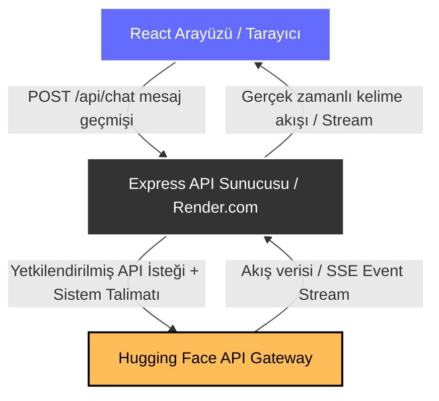

# CloudHost AI — Yapay Zekâ Destekli Bulut Barındırma Platformu

Bu proje, ödev grubumuz tarafından geliştirilen; kullanıcıların bulut sunucularını yönetebildiği, yeni sunucu paketleri satın alabildiği ve CloudHost altyapısı hakkında bilgi sahibi olan yapay zekâ asistanıyla sohbet edebildiği modern bir bulut hosting paneli uygulamasıdır.

Proje güvenliği ve performansını artırmak amacıyla mimarimiz **İstemci (Client)** ve **Sunucu (Server)** olmak üzere iki bağımsız katmana ayrılmıştır. Bu sayede Hugging Face API anahtarımız tarayıcı tarafında ifşa edilmeden sunucu tarafında tamamen güvenli bir şekilde gizlenmektedir.

---

## 🏗️ Proje Mimarisi ve Çalışma Akışı

Aşağıdaki şema, kullanıcının yapay zekâ asistanıyla mesajlaşırken verinin nasıl aktığını göstermektedir:



---

## 📂 Proje Dosya Yapısı

Projemizin klasör ve önemli dosya hiyerarşisi aşağıdaki gibidir:

```text
cloudhost-ai/
├── server/                     # Node.js Express API Sunucusu (Render.com Dağıtımı)
│   ├── index.js                # API rotaları, HuggingFace bağlantısı ve sunucu başlangıcı
│   ├── package.json            # Sunucu bağımlılıkları (express, cors, @huggingface/inference)
│   └── .env                    # Sunucu yerel çevre değişkenleri (HF_TOKEN)
│
├── src/                        # React Ön Uç (Frontend) Uygulaması
│   ├── components/             # Yeniden kullanılabilir React bileşenleri (NavBar, Footer, vb.)
│   ├── data/                   # Statik bilgi bankası dosyaları (knowledgeBase.js)
│   ├── hooks/                  # Özel React kancaları (useAIChat.js - API istek akışı)
│   ├── lib/                    # Yardımcı yardımcı programlar ve parser fonksiyonları
│   ├── pages/                  # Sayfa bileşenleri (Ana Sayfa, Servisler, Satın Alma, Hakkımızda)
│   ├── store/                  # Redux Toolkit durum yönetim (state management) dosyaları
│   ├── App.jsx                 # Yönlendirme (React Router) ve ana şablon yerleşimi
│   └── main.jsx                # React başlangıç noktası
│
├── vite.config.js              # Vite yapılandırma ve yerel geliştirme proxy ayarları
├── package.json                # Ön uç bağımlılık ve script dosyaları
└── README.md                   # Proje tanıtım ve kurulum belgesi (Bu dosya)
```

---

## 🚀 Projeyi Yerelde Çalıştırma Talimatları

Projeyi kendi bilgisayarınızda çalıştırmak için aşağıdaki adımları sırasıyla uygulayınız:

### 1. Backend (Sunucu) Kurulumu ve Çalıştırılması

1. Terminalde `server` klasörüne geçiş yapın:
   ```bash
   cd server
   ```
2. Gerekli paketleri yükleyin:
   ```bash
   npm install
   ```
3. `server` klasörü içinde `.env` adında bir dosya oluşturun ve Hugging Face API anahtarınızı ekleyin:
   ```text
   HF_TOKEN=hf_sizin_huggingface_api_anahtariniz
   ```
4. Sunucuyu başlatın:
   ```bash
   npm start
   ```
   _Sunucunuz varsayılan olarak `http://localhost:3000` portunda çalışacaktır._

### 2. Frontend (Ön Uç) Kurulumu ve Çalıştırılması

1. Ana proje dizinine geri dönün:
   ```bash
   cd ..
   ```
2. Ön uç bağımlılıklarını yükleyin:
   ```bash
   npm install
   ```
3. React uygulamasını yerel geliştirme modunda başlatın:
   ```bash
   npm run dev
   ```
   _Uygulama tarayıcınızda otomatik olarak açılacaktır (genelde `http://localhost:5173`)._

---

## 🌐 Canlı Ortam Dağıtımı (Deployment)

### 1. API Sunucusu (Render.com)

Express sunucusunu Render üzerinde yayına almak için:

1. Render paneline girip **New Web Service** seçeneğini seçin.
2. Github deponuzu bağlayın.
3. Ayarları şu şekilde yapılandırın:
   - **Root Directory:** `server`
   - **Build Command:** `npm install`
   - **Start Command:** `node index.js`
4. **Environment Variables** bölümüne gidin ve `HF_TOKEN` değişkenine Hugging Face anahtarınızı tanımlayın.

### 2. Ön Uç Uygulaması (Vercel)

React arayüzünü Vercel üzerinde yayına almak için:

1. Vercel paneline girip projenizi bağlayın.
2. **Environment Variables** ayarlarına gelin ve aşağıdaki değişkeni ekleyin:
   - **Key:** `VITE_API_URL`
   - **Value:** `https://render-uzerindeki-app-isminiz.onrender.com` (Render'ın size verdiği backend URL'i)
3. Dağıtımı (Deploy) başlatın.

---

## 👥 Grup Çalışması Notu

Bu proje, bulut hosting ve modern web mimarisi ödevi kapsamında grup arkadaşlarımızla birlikte ortaklaşa geliştirilmiştir. Tasarımda modern CSS, dinamik SVG animasyonları, Redux entegrasyonu ve güvenli asenkron yapay zekâ SSE veri akışı teknikleri harmanlanmıştır.
