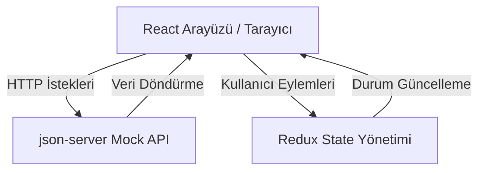

# Kütüphane++ — Dijital Kütüphane Yönetim ve Rezervasyon Platformu

Bu proje, kullanıcıların kitapları arayabildiği, rezervasyon yapabildiği, ödünç alma ve iade süreçlerini takip edebildiği, çalışma masası ve toplantı odası rezervasyonu gerçekleştirebildiği modern bir dijital kütüphane uygulamasıdır. Kütüphane++; kullanıcı deneyimini ön planda tutan, React tabanlı bir tek sayfa uygulama (SPA) olarak geliştirilmiştir.

---

## 🏗️ Proje Hakkında

Kütüphane++, geleneksel kütüphane işlemlerini dijital ortamda kolaylaştırmayı hedefleyen bir web platformudur. Uygulama sayesinde kullanıcılar:

- kitapları arayabilir ve detaylarını görüntüleyebilir,
- kitap rezervasyonu ve ödünç alma süreçlerini yönetebilir,
- favori kitaplarını takip edebilir,
- çalışma masası ve toplantı odası rezervasyonu yapabilir,
- bildirimleri inceleyebilir ve profil bilgilerini yönetebilir.

Ayrıca yöneticiler için özel bir panel üzerinden kitap, kullanıcı, rezervasyon ve etkinlik yönetimi yapılmaktadır.

---

## 🔄 Uygulama Akışı

Aşağıdaki yapı, kullanıcıların uygulama içindeki veri akışını göstermektedir:



---

## 📂 Proje Dosya Yapısı

```text
kutuphane-plus-plus/
├── public/                   # Statik dosyalar
├── src/                      # Ana kaynak kodu
│   ├── components/           # Yeniden kullanılabilir bileşenler
│   ├── hooks/                # Özel React hook'ları
│   ├── layouts/              # Sayfa yerleşimleri
│   ├── pages/                # Uygulama sayfaları
│   ├── store/                # Redux slice ve store yapısı
│   ├── utils/                # Yardımcı fonksiyonlar
│   ├── App.jsx               # Ana uygulama bileşeni
│   └── main.jsx              # Uygulama giriş noktası
├── db.json                   # Mock veritabanı
├── package.json              # Bağımlılıklar ve scriptler
├── vite.config.js           # Vite yapılandırması
└── README.md                 # Proje dokümantasyonu
```

---

## ✨ Ana Özellikler

- Kütüphane katalogu ve gelişmiş arama filtresi
- Kitap detay sayfası ve yorum/puanlama alanı
- Rezervasyon ve ödünç yönetimi
- Çalışma masası ve toplantı odası rezervasyonu
- Favori kitaplar ve kullanıcı geçmişi
- Bildirim merkezi
- Yönetici paneli
- Modern, karanlık tema tasarımı

---

## 🛠️ Teknoloji Yığını

- React 19
- Vite
- Redux Toolkit
- React Router DOM
- Tailwind CSS
- AG Grid
- json-server

---

## 🚀 Yerelde Çalıştırma

Projeyi bilgisayarınızda çalıştırmak için aşağıdaki adımları takip edin:

### 1. Bağımlılıkları Yükleyin

```bash
npm install
```

### 2. Geliştirme Ortamını Başlatın

Proje, hem frontend hem de mock API sunucusunu birlikte başlatacak şekilde tasarlanmıştır:

```bash
npm run dev:all
```

Bu komut şu iki hizmeti başlatır:

- Vite geliştirme sunucusu: http://localhost:5173
- JSON Server: http://localhost:5000

### 3. Sadece Frontend'i Çalıştırmak İsterseniz

```bash
npm run dev
```

### 4. Sadece Mock API Sunucusunu Çalıştırmak İsterseniz

```bash
npm run server
```

---

## 🧪 Build İşlemi

Production build oluşturmak için:

```bash
npm run build
```

---

## 📌 Not

Bu proje, mock veri yapısı üzerinde çalıştırılmak üzere hazırlanmıştır. Geliştirme sırasında veriler [db.json](db.json) dosyasından okunur ve güncellenir.

---

## 👥 Proje Hakkında Kısa Not

Kütüphane++ projesi, modern web teknolojileri ile kullanıcı odaklı bir kütüphane deneyimi sunmayı amaçlayan bir eğitim ve geliştirme projesidir.
